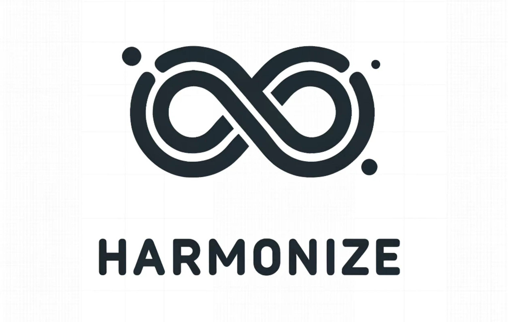

A next-generation, **omnichain** solution that integrates wallets, liquidity pools, and dynamic, programmable cross-chain command execution. Harmonize is designed to unify disparate blockchains — unifying them into what feels like one seamless ecosystem. From managing assets across chains to creating custom smart contract workflows, Harmonize aims to bring order (and _harmony_) to multi-chain complexity.

## Table of Contents

- [Overview](#overview)
- [Features](#features)
- [Architecture](#architecture)
- [Contracts](#contracts)
  - [Endpoint.sol](#endpointsol)
  - [Coin.sol](#coinsol)
- [Canister](#canister)
- [Quick Start](#quick-start)
- [Contribution](#contribution)
- [License](#license)

---

## Overview

Harmonize is an ambitious project that aims to solve the fragmentation problem in blockchain ecosystems. By combining a **cross-chain wallet**, a **multi-chain AMM**, and **customizable execution** of smart contracts across multiple networks, Harmonize becomes the one-stop hub for any on-chain or off-chain developer.

### Why Harmonize?

- **Unified Wallet**: Seamlessly manage assets across various EVM-based chains and the Internet Computer (IC).
- **Cross-Chain Liquidity**: Access multi-chain liquidity pools, create markets, and execute trades without having to jump between networks.
- **Programmable Workflows**: Build advanced, automated workflows to trigger transactions on multiple chains in response to on-chain or external events.

---

## Features

- **Omnichain Wallet**  
  A single management interface for all your EVM-based assets and IC-based assets. Deposit, withdraw, or transfer tokens across chains.

- **Omnichain Liquidity Pools / AMM**  
  Create and manage liquidity pools spanning different blockchains. Enjoy a simplified user experience for cross-chain swaps and yield generation.

- **Programmable Command Execution**  
  Define, schedule, or trigger complex cross-chain operations (e.g., bridging, swapping, interacting with DeFi protocols) all in one place.

- **Secure & Trust-Minimized**  
  Leveraging the Internet Computer’s ECDSA capabilities to ensure robust security across chain boundaries.

---

## Architecture

Below is a high-level look at how Harmonize pieces work together:

1. **Endpoint Contracts (EVM)**  
   Deployed on Ethereum or other EVM-compatible chains. They allow users or external contracts to deposit native tokens or ERC20 tokens, which then emit deposit events recognized by the Harmonize canister on the Internet Computer.

2. **Harmonize Canister (IC)**  
   - **Event Listener**: Listens for deposit events and updates the user’s wallet balance inside the canister.
   - **Virtual Accounts & AMM**: Stores user balances in a cross-chain aware manner, enabling swaps and liquidity operations across multiple networks.
   - **Command Dispatch**: Executes or schedules transactions (e.g., swaps, yield strategies, bridging) on behalf of the user across different blockchains.

3. **Orchestration & Automation**  
   Optional but highly recommended for advanced workflows: set up watchers or triggers to automatically call Harmonize canister methods whenever an event meets predefined criteria.

---

## Contracts

### `Endpoint.sol`

Our minimal deposit gateway for bridging tokens or ETH from an EVM chain into Harmonize.  

- **DepositEth**: Receives native ETH, transfers it to the Harmonize address, and emits a `DepositEth` event.  
- **DepositErc20**: Receives ERC20 tokens via `transferFrom`, sends them to Harmonize, and emits a `DepositErc20` event.

```solidity
event DepositEth(
    address indexed sender,
    bytes32 indexed recipient,
    uint256 amount
);

event DepositErc20(
    address indexed sender,
    bytes32 indexed recipient,
    address indexed token,
    uint256 amount
);
```

Harmonize scans for these events on their source network, updating its internal ledgers accordingly.

### `Coin.sol`
A simple ERC20 contract used for testing and demonstration.

---

## Canister

Inside `src/harmonize_backend`, you’ll find the core logic for:
- **State Management**: Storing user balances, tracking network state, handling tasks (swapping, bridging, etc.).
- **Cross-Chain Orchestration**: Listening to deposit events via RPC calls to EVM blockchains.  
- **ECDSA Integration**: Securing cross-chain messages and transactions with Internet Computer’s ECDSA functionality.

### Highlights

- **`wallet.rs`**: Contains the logic for crediting, debiting, transferring, and withdrawing tokens from user accounts in the canister.
- **`chain_fusion`**: Modules and jobs for orchestrating cross-chain events, including EVM calls, logs scraping, and safe transaction execution.
- **`pool.rs`**: Basic AMM logic for future cross-chain liquidity pools.

---

## Quick Start

1. **Clone Repository**  
   ```bash
   git clone https://github.com/example/harmonize.git
   cd harmonize
   ```

2. **Install Dependencies**  
   - For the **canister**: ensure you have [dfx](https://internetcomputer.org/docs/current/developer-docs/build/install-upgrade-remove) installed.  
   - For the **contracts**: install [Node.js](https://nodejs.org/) and [Hardhat](https://hardhat.org/), then run:
     ```bash
     cd src/harmonize_contracts
     npm install
     ```
   - During development we recommend to use **caddy** for enabling https communications with hardhat nodes.
3. **Deploy**  
   - Setting up a local environment for development and testing is a pretty involved process. To make things easier, we provide a number of scripts and snippets. To get a full setup running on your host machine, simply run:
     ```bash
     cd ..
     ./run-and-initialize.sh
     ```
   - This script will start two local hardhat nodes, provide a reverse proxy (caddy) to enable https, deploy endpoints on each network and run the harmonize canister with the appropriate endpoint and network configurations.

5. **Interact**  
   - **Deposit** tokens or ETH on the EVM side via `Endpoint` contract.  
   - **Check** your deposit on the IC side by calling the canister methods.  
   - **Transfer** or **Withdraw** from your Harmonize “virtual account” to other addresses or chain endpoints.

---

## Contribution

We currently do not accept contributions on this repository.

---

## License

All rights reserved.
